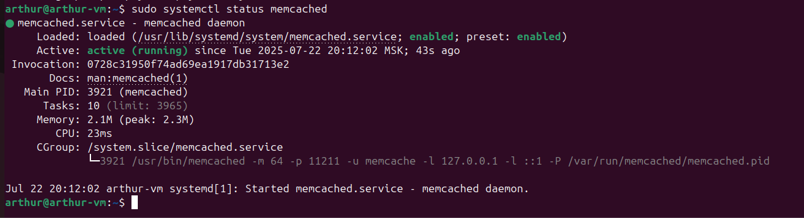
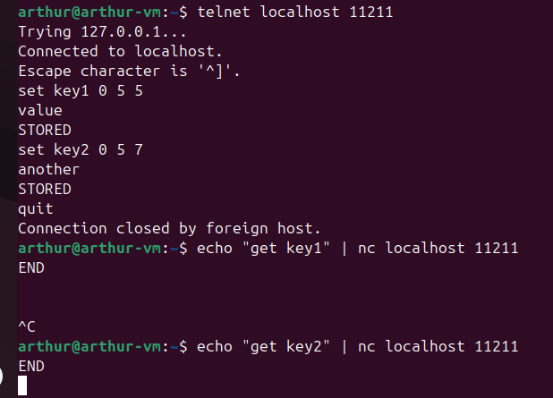

# Домашнее задание: «Кеширование Redis/Memcached»

## Задание 1. Кеширование — какие проблемы оно решает?

### 1. Высокая задержка ответов
- **Проблема:** Медленные запросы к БД/внешним API.
- **Решение:** Кешируем результат (TTL 5–60 сек) → ответ из памяти за миллисекунды.

### 2. Перегрузка базы данных
- **Проблема:** Пиковые одинаковые запросы «кладут» БД.
- **Решение:** Кеш снимает повторные чтения, БД обслуживает только «первичные» запросы.

### 3. Дорогие вычисления
- **Проблема:** Отчёты, агрегаты, рендеринг — долго и дорого по CPU.
- **Решение:** Кешируем готовый результат, обновляем по TTL или по событию изменения данных.

### 4. Лимиты внешних сервисов (rate limits)
- **Проблема:** Частые вызовы стороннего API выбивают квоты.
- **Решение:** Кешируем ответы, уменьшаем число обращений.

### 5. Хранение сессий и токенов
- **Проблема:** Нужно мгновенно проверять авторизацию множества пользователей.
- **Решение:** Redis как in-memory хранилище с TTL для сессий/токенов.

### 6. Кеширование страниц/фрагментов
- **Проблема:** Динамические страницы генерируются медленно.
- **Решение:** Full-page/fragment cache — отдаём HTML сразу.

### 7. Дедупликация задач и блокировки
- **Проблема:** Несколько процессов запускают один тяжёлый расчёт.
- **Решение:** Lock в Redis: первый ставит ключ, остальные ждут/пропускают.

### 8. Быстрые счётчики и метрики
- **Проблема:** Нужно мгновенно считать лайки/просмотры.
- **Решение:** INCR/DECR в Redis, периодический сброс в персистентную БД.

### 9. Идемпотентность запросов
- **Проблема:** Повторная отправка платежа/формы.
- **Решение:** Хранить idempotency-key в кеше и отбрасывать дубли.

---

## Задание 2. Memcached

Установлен и запущен memcached.

Статус службы:

Loaded: loaded (/us/Lib/systemd/system/memcached. service; enabled; preset: enabled)
Active: active (running) since Tue 2025-07-22 20:12:02 MSK; 43s ago

Скриншот статуса:

---

## Задание 3. Удаление по TTL в Memcached

Установлены ключи с TTL 5 секунд:

set key1 0 5 5
value
STORED
set key2 0 5 7
another
STORED

Через 5 секунд ключи удалились:

END
END

Скриншот подтверждения:

